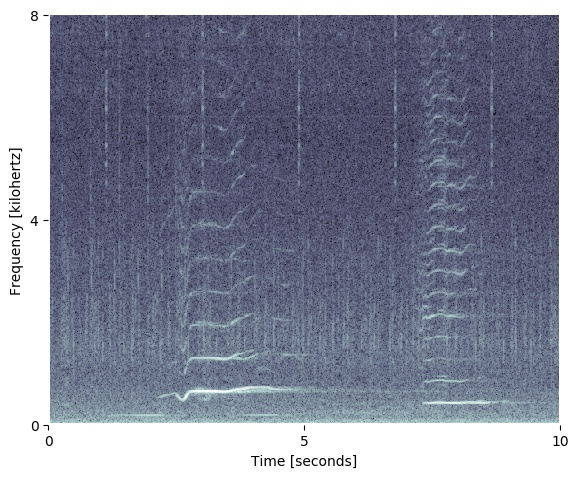
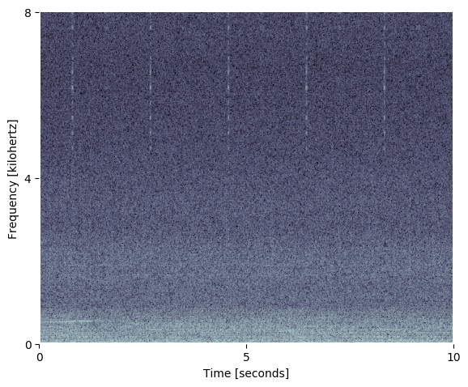

# Whaledr spectrogram generation

This section of the Pipeline involves generating [spetrograms](https://en.wikipedia.org/wiki/Spectrogram) which would be eventually used by the model to classify whale sound.

|     Whale Spectrogram    |    Non-Whale Spectrogram     |
|--------------------------|------------------------------|
|  |  |
|  | 


## Setup

The setup involves two steps:
   - Setting up the environment
   - Setting up the requisite credentials

### Environment

```
wget https://repo.continuum.io/miniconda/Miniconda3-latest-Linux-x86_64.sh
bash Miniconda3-latest-Linux-x86_64.sh
rm Miniconda3-latest-Linux-x86_64.sh
source ~/.bashrc
conda create -n whaledr python=3.6
conda activate whaledr
git clone https://github.com/whaledr/cetus.git
pip install -r requirements.txt
cd cetus/data-preprocessing
```

### Credentials

Run this as a python script or in a python terminal to save necessary credentials in your home directory, which would be later used the parent script ```spectrogram_generator.py```.

```
import json
import os
from os.path import expanduser

home = expanduser("~")
# store one time credentials in the home directory
creds = {'key_id' : '', # replace the empty string with your access_key_id
         'key_access' : '' # replace the empty string with your provide secret_access_key
         } 
with open(os.path.join(home,'creds.json'), 'a') as cred:
    json.dump(creds, cred)

```
Once done correctly you should be good to go to execute the script. It is recommended to use either nohup or screen command to run process in the background:

```nohup python spectrogram_generator.py &```


***Recommended setup for running this script without failure is AWS c5.4xlarge and using 6 cores instead of all 16.
The process runs into memory issues if number of cores used and total memory available is not taking into consideration and owing to multiproceessing it can get difficult to debug at times.***

## Further Reading

For more detailed explaination of the process alongside do's and dont's while running the script refer to this elaborate documentation:[whale_spectrogram](https://github.com/whaledr/whalebooks/tree/master/shiv/whale_spectrogram)   
